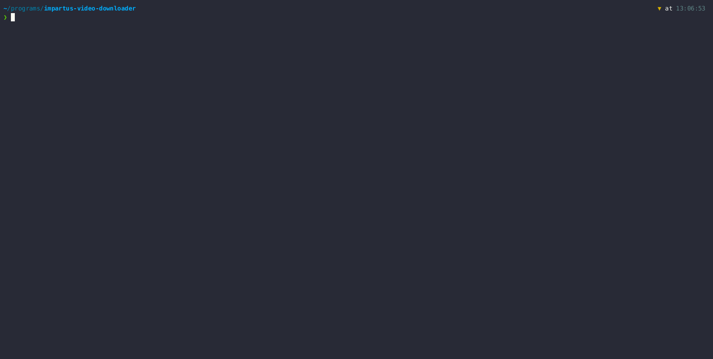

# impartus video downloader

- [impartus video downloader](#impartus-video-downloader)
  - [Demo](#demo)
  - [How to use](#how-to-use)
    - [Selecting lectures](#selecting-lectures)
  - [Configuration](#configuration)
  - [FAQ/Troubleshooting](#faqtroubleshooting)
    - [How do I run this?](#how-do-i-run-this)
    - [IT IS NOT WORKING!!!!](#it-is-not-working)
    - [I changed the credentials but it is not giving me data for the new credentials](#i-changed-the-credentials-but-it-is-not-giving-me-data-for-the-new-credentials)
    - [Does it download both the views?](#does-it-download-both-the-views)
    - [How do I change to different views in \[insert software name\]?](#how-do-i-change-to-different-views-in-insert-software-name)
    - [How to download slides?](#how-to-download-slides)
    - [Where are my slides???](#where-are-my-slides)

## Demo



## How to use

-   Have [ffmpeg](https://ffmpeg.org/download.html) installed on your pc and have it in your **PATH**.
-   [Download](https://github.com/pnicto/impartus-video-downloader/releases/latest) the latest release and extract it.
-   Add your username/email and password in `config.json`.
-   Make suitable changes to the config as per your needs. Read [here](#configuration) for more information on configuration.
-   Execute the binary.

### Selecting lectures

When prompted to enter a range do the following

-   Enter the numbers shown on the left (not the lecture number after "LEC")
-   If you want lectures from 1 to 10, this is how your input will be `1 10`. The range is inclusive.
-   If you want only 1 lecture say 5, your input should be `5 5`.
-   Make sure you add space between the start and end.

## Configuration

The comments beside the fields tell the allowed values.

```jsonc
{
    "username": "uid@hyderabad.bits-pilani.ac.in",
    "password": "password",
    "baseUrl": "http://bitshyd.impartus.com/api", // Accepted values: "http://bitshyd.impartus.com/api", "http://172.16.3.20/api"
    "quality": "720", // Accepted values: "720", "450", "144"
    "views": "both", // Accepted values: "left", "right", "both"
    "downloadLocation": "./downloads", // Directory where the final file is stored to
    "tempDirLocation": "./.temp", // Directory to store the chunks (directory can be deleted when the program is not running)
    "slides": false, // Accepted values: true, false to download the slides from impartus,
    "numWorkers": 5 // Number of workers to use set this to 1 if you want to download the videos sequentially. Setting this to 0 will use a default number that is 5
}
```

## FAQ/Troubleshooting

### How do I run this?

Refer to the [How to use](#how-to-use) section.

### IT IS NOT WORKING!!!!

-   Make sure you have the latest version.
-   Make sure you have the correct username and password.
-   Make sure you have the correct baseUrl.
-   Make sure you have ffmpeg installed and in your PATH.
-   Make sure the website is working.

Despite all of them being correct if it is not working, open an issue.

### I changed the credentials but it is not giving me data for the new credentials

Delete the `.token` file. This was a mistake on my part. The program caches the token and does not check for new credentials. This may or may not be fixed in the future.

### Does it download both the views?

Yes. It downloaded both the views if they are available and are selected in the `config.json`.

### How do I change to different views in [insert software name]?

You are on your own here. I use `mpv` and it has a shortcut key https://github.com/mpv-player/mpv/issues/8065 for the same. For `VLC` the functionality is available from my understanding in some menu. For other software, you will have to look it up.

### How to download slides?

Set `slides` value to `true` in `config.json`.

### Where are my slides???

The slides are located in the same folder as the videos.
